# CareerIQ — AI Career Intelligence Platform

CareerIQ is a full-stack AI-powered platform designed to support students and professionals in planning, preparing, and progressing in their careers. It brings together multiple career development tools into a single system, enabling structured learning, intelligent guidance, and measurable improvement.

---

## Overview

CareerIQ addresses the gap between academic learning and industry expectations by providing a unified environment for career preparation. The platform integrates AI-driven features with a scalable architecture to deliver personalized and practical career support.

---

## Problem Statement

Many students and job seekers face the following challenges:

* Lack of a clear and structured career roadmap
* Limited access to realistic interview practice
* Difficulty creating professional, ATS-compliant resumes
* No centralized system to track preparation and performance
* Fragmented tools across different platforms

---

## Solution

CareerIQ provides a centralized platform that:

* Generates personalized career roadmaps based on user goals
* Simulates interview environments with AI-based feedback
* Assists in building structured and professional resumes
* Offers aptitude testing with performance evaluation
* Tracks user progress and highlights improvement areas

---

## Features

### AI-Based Career Roadmaps

* Generates step-by-step learning paths
* Aligns skills with career goals

### Mock Interview System

* Simulates interview scenarios
* Provides feedback on responses

### Resume Builder

* Generates ATS-friendly resumes
* Suggests improvements in content and structure

### Aptitude Testing

* Role-based and difficulty-based quizzes
* Instant scoring and evaluation

### Progress Tracking Dashboard

* Displays performance metrics
* Identifies strengths and weak areas

---

## Tech Stack

### Frontend

* React (Vite)
* Tailwind CSS
* Framer Motion
* Axios

### Backend

* Django
* Django REST Framework
* FastAPI

### AI Integration

* Groq API
* LangChain

### Database

* SQLite / PostgreSQL

---

## System Architecture

CareerIQ follows a dual-backend architecture:

* Django handles authentication, user management, and core business logic
* FastAPI handles AI processing and high-performance endpoints
* React frontend communicates with both services via APIs

---

## Screenshots

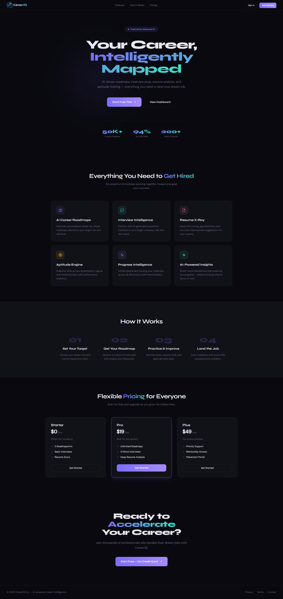
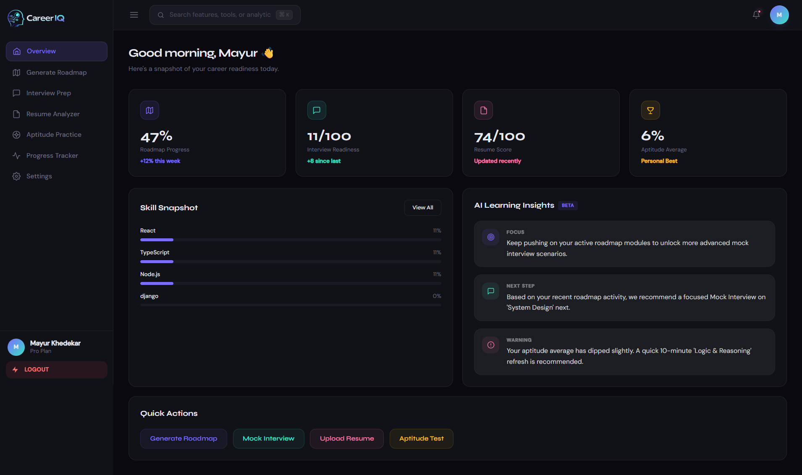
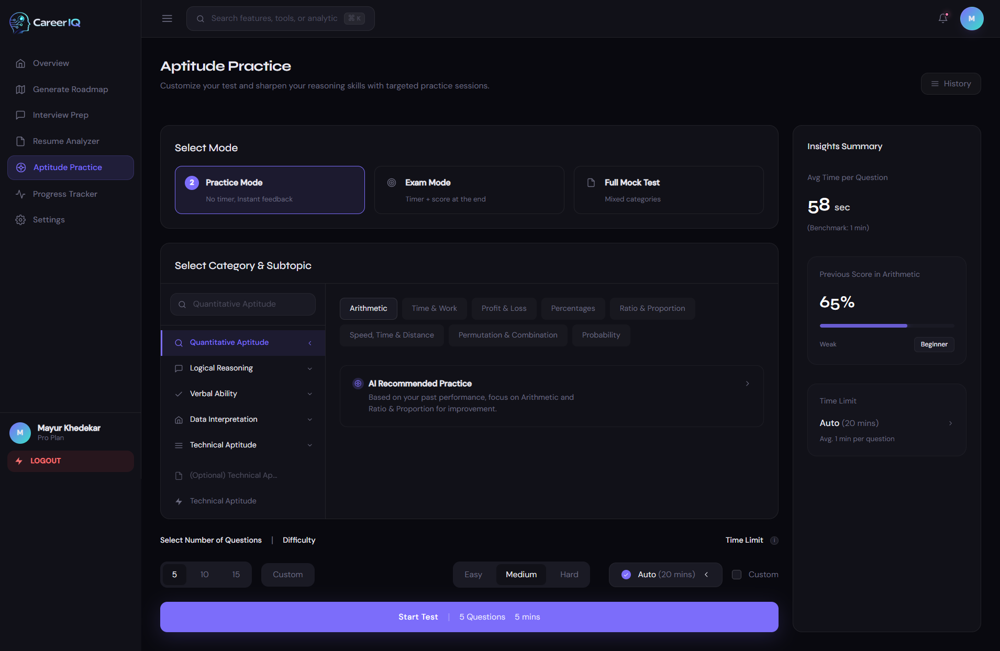
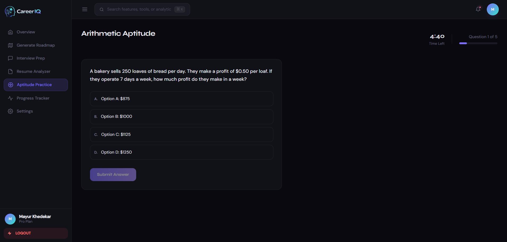
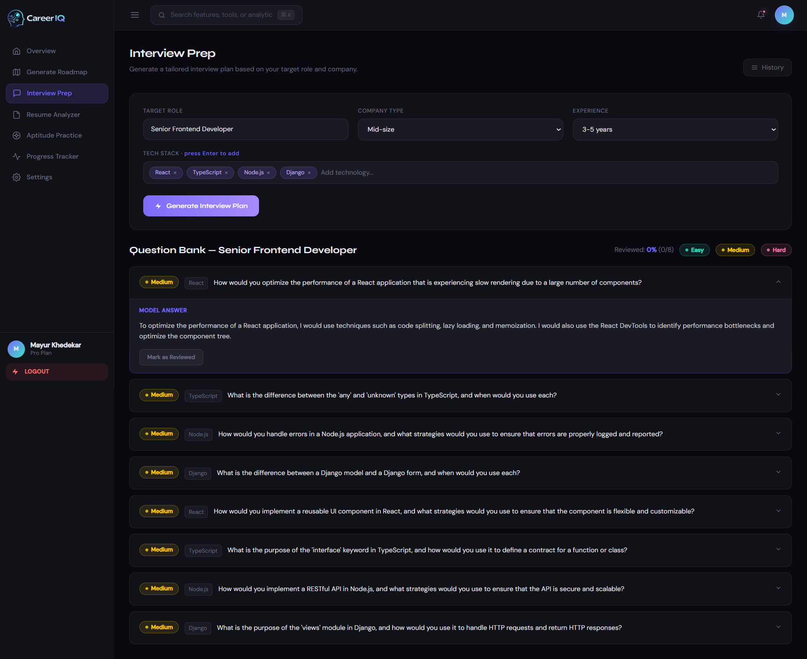
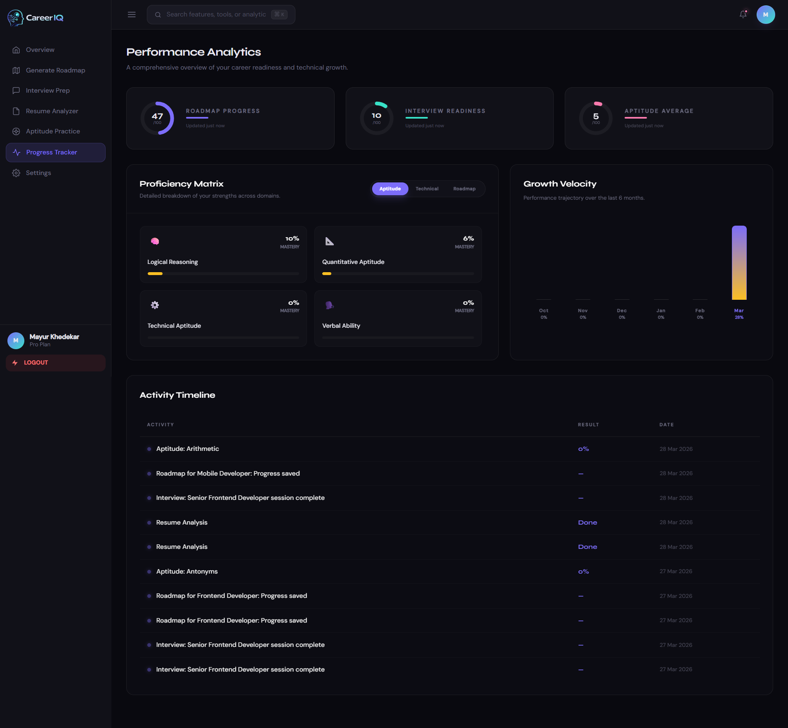
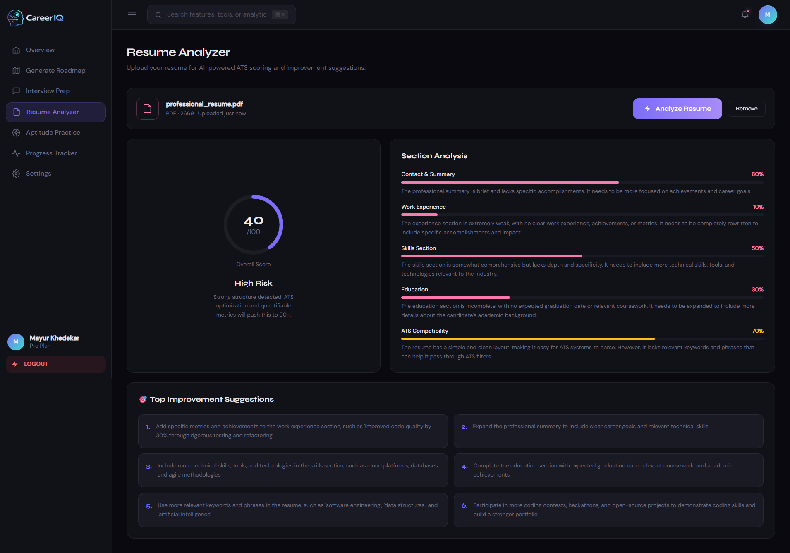
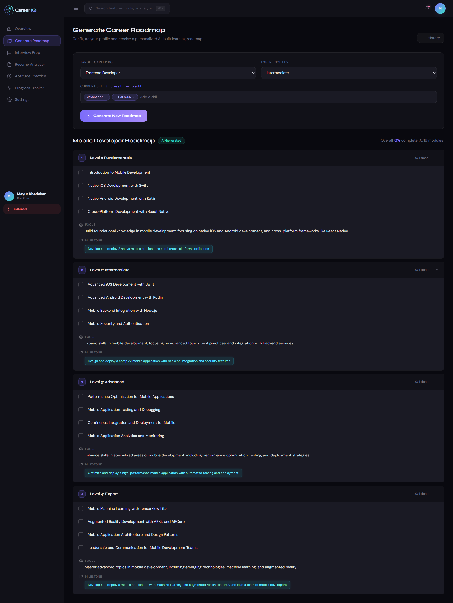
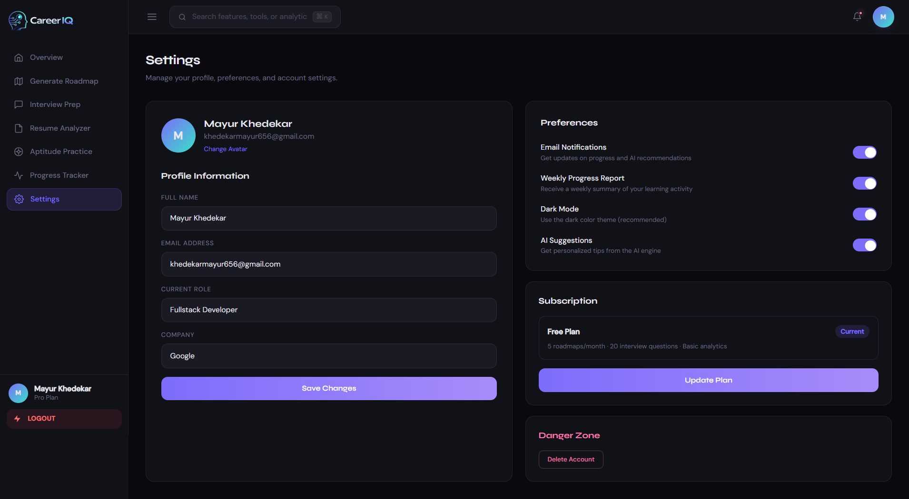
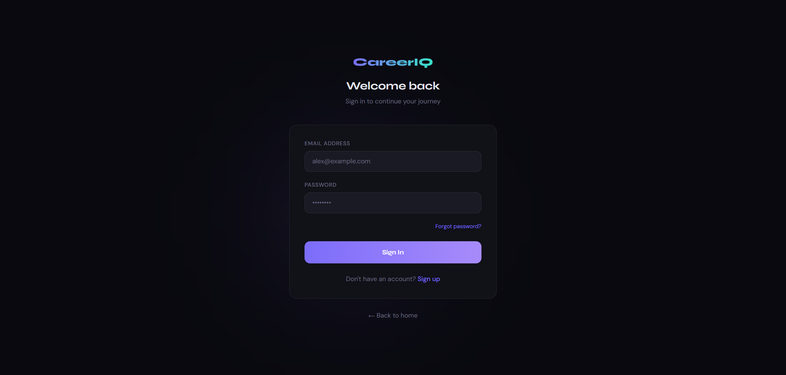
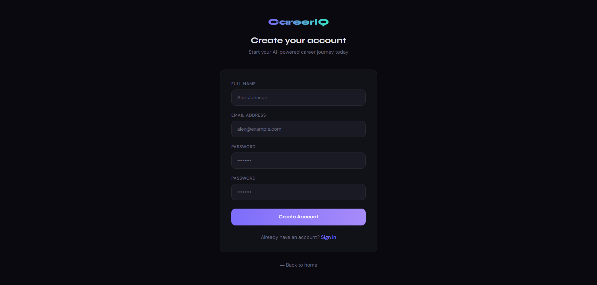

---

## Installation and Setup

### Clone the Repository

```bash
git clone https://github.com/your-username/careeriq.git
cd careeriq
```

### Frontend Setup

```bash
cd frontend
npm install
npm run dev
```

### Django Backend Setup

```bash
cd backend/django_app

python -m venv env
env\Scripts\activate   # Windows
source env/bin/activate # macOS/Linux

pip install -r requirements.txt

python manage.py makemigrations
python manage.py migrate
python manage.py runserver
```

### FastAPI Backend Setup

```bash
cd backend/fastapi_app

python -m venv env
env\Scripts\activate

pip install -r requirements.txt

uvicorn main:app --reload --port 8001
```

---

## Environment Configuration

Create a `.env` file in the FastAPI directory:

```bash
GROQ_API_KEY=your_api_key_here
```

---

## Future Scope

* Adaptive learning system based on user performance
* Job and internship recommendation system
* Resume scoring with ATS simulation
* Voice-based interview interaction
* Mobile application

---

## Author

Mayur Khedekar

---

## Conclusion

CareerIQ is designed as a practical career development platform that combines AI capabilities with structured preparation tools. It aims to provide a more focused and measurable approach to career growth compared to using multiple disconnected tools.
